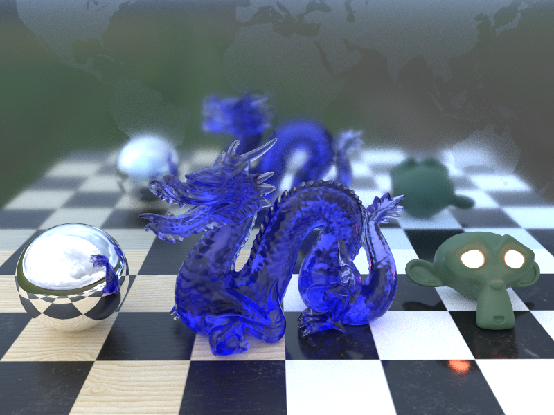

# PathTracer

A small path-tracing renderer written in C++ 20 for educational purposes.

At this time it only uses CPU computation. In the future, however, I will port the algorithms to GPU as well. I have CUDA and DirectX Raytracing (DXR) in mind.

At this time the program is command-line only and doesn't have a user interface; an interactive UI is planned in the future.

## Usage

Build with CMake and run the `PathTracer` executable. Use `-h` flag to list options.

Provide a path to a valid GLTF or GLB file with `-f` flag to render the model.

Provide an environment HDR image with `-e` flag or choose `white` or `black` for a default environment map.

If GLTF file contains cameras, the first camera is used, otherwise the model is rendered from the front.

Additional command-line options include: 

 - output image path `-o`
 - ray program mode (simple raycasting, AO only, or full PBR rendering) `-p`
 - acceleration structure type (Naive or Bounding Volume Hierarchies) `-a`
 - resolution `--width` and `--height`
 - number of samples per pixel `-s`
 - maximum number of ray bounces `-b`
 -  and some others...

Try it by copying `PathTracer` executable to `/example` folder and running

    ./PathTracer -f ./scene.glb -e ./farmland_overcast_1k.hdr -o snapshot.png -s 300 -b 6

This image was rendered in 199 seconds on Intel Core i7-11800H @ 2.30GHz; 

Same scene took 110 seconds in Blender CPU rendering with similar parameters

## Features

PBR ray program mode renders images using path tracing with support for:

 - Opaque material = Lambertian diffuse + GGX microsurface with all standard GLTF textures: Albedo, RoughnessMetallic, Normal map
 - Transmissive materials (via `KHR_materials_transmission`) with absorption with several limitations that will be addressed in the future, for example: you can't accurately render nested volumes of transmissive materials that are inside of each other and absorption can have artifacts in case there are other opaque objects inside transmissive volumes. And to properly render transmissive materials refractions you **MUST** specify it with `KHR_materials_volume`. 
 - Emissive materials with `KHR_materials_emissive_strength`
 - `KHR_materials_ior` for IOR manipulation
 - Alpha blending and masking

## Dependencies

This project uses the following libraries:
 - fastgltf
 - glm
 - STB
 - argparse
 - MikkTSpace
 - *Google Test (unused for now)*
 - *Dear IMGUI (unused for now)*

